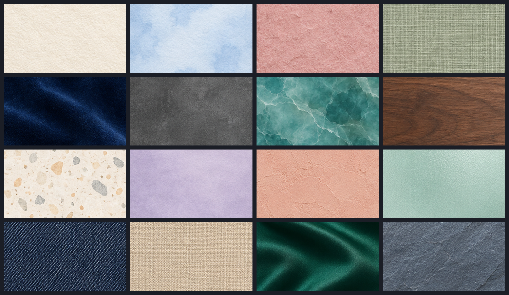

# 视频编辑标题卡背景材质图集（2026-09-27）

本批通过一次 ImageGen 生成 4×4 图集，再裁成 16 张独立的 1920×1080 背景图。它们适合作为标题卡、字幕底板或画面衬底；纹理细节保持克制，避免小尺寸画面上盖住文字。

| 顺序 | 名称 | 顺序 | 名称 |
|---:|---|---:|---|
| 1 | 米白棉纸 | 9 | 奶油水磨石 |
| 2 | 浅蓝水彩纸 | 10 | 淡紫描图纸 |
| 3 | 玫瑰手工纸 | 11 | 蜜桃灰泥 |
| 4 | 鼠尾草亚麻 | 12 | 薄荷磨砂玻璃 |
| 5 | 深蓝丝绒 | 13 | 靛蓝牛仔布 |
| 6 | 炭灰水泥 | 14 | 沙色画布 |
| 7 | 青绿云石 | 15 | 翡翠缎面 |
| 8 | 胡桃木纹 | 16 | 蓝灰板岩 |

## 可复现文件

- 原始图集：[`docs/assets/video-background-material-atlas-20260927.png`](assets/video-background-material-atlas-20260927.png)
- 裁切坐标、尺寸与 SHA-256：[`docs/assets/video-background-material-atlas-20260927.extraction.json`](assets/video-background-material-atlas-20260927.extraction.json)
- 接触表：[`docs/assets/video-background-material-atlas-20260927-contact.png`](assets/video-background-material-atlas-20260927-contact.png)
- 提取器：[`scripts/extract_video_background_material_atlas_20260927.py`](../scripts/extract_video_background_material_atlas_20260927.py)
- 16 张资源：`src/cutvoke/assets/backgrounds/bgmat_*.jpg`

提取器按 4×4 等分单元向内缩 12 像素以避开图集分隔线，居中裁切后用 Lanczos 缩放到 1920×1080，保存为高质量 JPEG。脚本会校验已存在文件；内容不同则报错，不静默覆盖。

资源清单将它们登记为“标题卡材质背景”，由内置背景资产注册流程加入素材库。资源包升至 v1.37.0：827 项资源、4,557 个哈希记录文件、42 张背景。离线包为 [cutvoke-builtin-resources-1.37.0.zip](../output/acceptance/video-background-material-textures-20260927-v1.37.0.zip)，84,051,894 字节，SHA-256 `c64e50e1721eab2f461d3b097ade541bbf568e60617039b12c9747d110b416f5`。

## 验收范围

- `scripts/build_builtin_resource_pack.py --check`：通过。
- `tests/test_resource_pack_manifest.py`：11 项通过，覆盖新增 16 项的图集来源、授权说明、子类与图片文件。
- 内存素材库烟测：42 张内置背景均已登记，其中新增 16 张的探测尺寸均为 1920×1080。
- 离线 ZIP：逐项核对清单中的 4,557 个文件，大小及 SHA-256 均一致，包含 827 项资源和 42 张背景。
- 接触表已逐格目视检查：16 格完整、分隔线已去除、各材质有区分度。

生成来源记录为 OpenAI ImageGen。当前授权字段声明这些图片为项目内部 AI 生成资源，未单独许可再分发；加入对外资源包前仍需处理项目发行许可。
